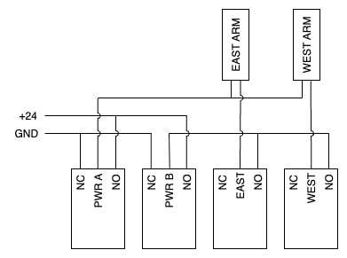

## W1m Mirror Cover Controller

Firmware for a [Raspberry Pi Pico W](https://cpc.farnell.com/raspberry-pi/raspberry-pi-pico-wh/rpi-pico-wireless-cyw43439-mcu/dp/SC19562) with [Pico Relay Board Module](https://cpc.farnell.com/sb-components/sku21178/raspberry-pi-pico-relay-board/dp/SC18046) to control the mirror covers on the W1m telescope.

### Protocol Commands:

| Command         | Use                      |
|-----------------|--------------------------|
| `?\n`           | Query current status     |
| `S\n`           | Stop any active movement |
| `O\n`           | Open the covers          |
| `C\n`           | Close the covers         |

### Protocol Responses:

| Response      | Meaning                           |
|---------------|-----------------------------------|
| `?\r\n`       | Unknown command                   |
| `$\r\n`       | Command acknowledged (except `?`) |
| `OPEN\r\n`    | Current status (response to `?`)  |
| `CLOSED\r\n`  | Current status (response to `?`)  |
| `OPENING\r\n` | Current status (response to `?`)  |
| `CLOSING\r\n` | Current status (response to `?`)  |
| `STOPPED\r\n` | Current status (response to `?`)  |
